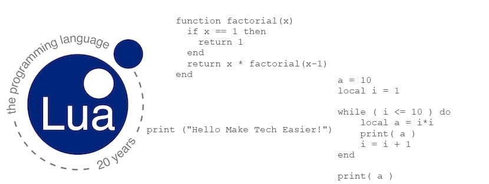

# Lua 🌙

  

Lua is a powerful, efficient, lightweight, embeddable scripting language. It supports several programming styles: procedural, object-oriented, functional, data-driven, and data description.  

Lua combines simple procedural syntax with powerful data description constructs based on associative arrays and extensible semantics. Lua is dynamically typed, runs by interpreting bytecode with a register-based virtual machine, and has automatic memory management with incremental garbage collection, making it ideal for configuration, scripting, and rapid prototyping.   

  

_Table of contents_

1. [Basics](basics/)  
    - [Hello World](basics/hello_world.lua)  
    - [keywords](basics/lua_keyword.txt)  
    - [Operators](basics/operators_inLua.lua)  
    - [Variable Types](basics/variable_types.lua)     
    - [functions](basics/functions_methods.lua)  
    - [loops](basics/loops_types.lua)  
    - [date (os)](basics/time_date.lua)  
    

